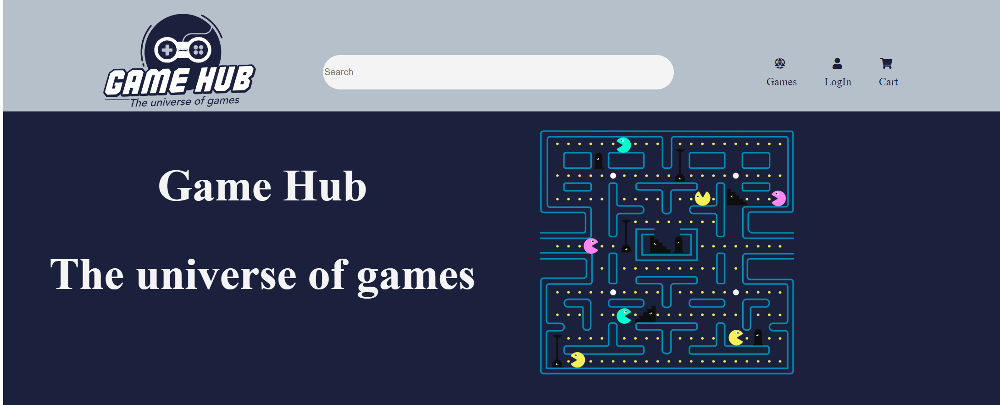

# GameHub-assignment



## Description

My first project using HTML and CSS as a frontend student at Noroff.

My "client" was a GameHub, an online shop where users can purchase computer games. 

The site architecture:

- Home
- List of games
- A games page showing the product details
- Checkout page
- Checkout succsess
- About
- Contact

## Build with

It's build with pure HTML and CSS.

We also had design the page before coding it, here's a like to my figma fil:
[My figma fil](https://www.figma.com/design/XVP8NRMdIi1OVJ6oWGXPAX/GameHub?node-id=6-560&t=MQCchaQmdeYhuVIL-1)

### Installing

Clone the repo:
```bash
git clone 
https://github.com/Iseost/Gamehub.git
```

## Contributing

Please review my code and feel free to suggest improvements. Make sure to open a pull request, so the code can be reviewed.

Keep in mined that this is my first ever html and css project. Thank you :)

## Contact

Link to my linkedin profile. 

[My LinkedIn page](www.linkedin.com/in/iselin-østerhus-engen-767b46284)
